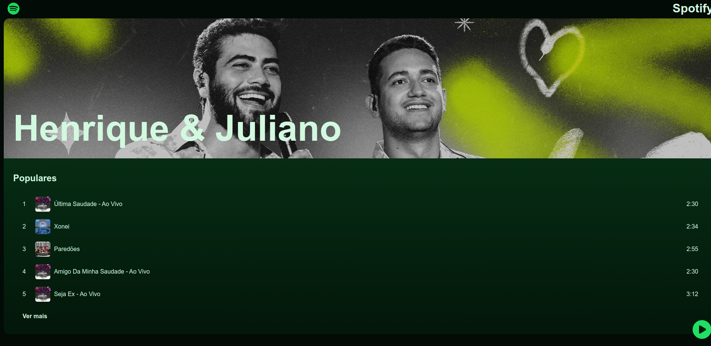
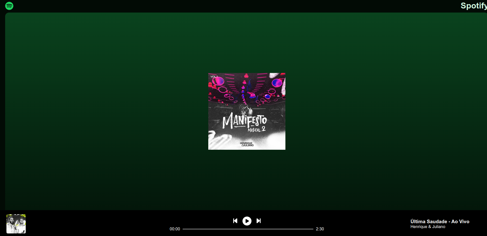
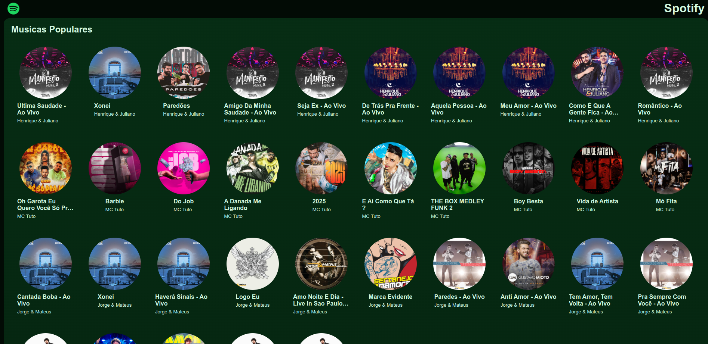

# 🎵 Spotify Clone

Este é um projeto de clone do Spotify desenvolvido com **JavaScript, MongoDB, HTML, CSS, React e Vite**. O objetivo foi recriar a interface e funcionalidades essenciais da plataforma de streaming de música.

## Tecnologias Utilizadas

- **Frontend:** React, Vite, HTML, CSS
- **Backend:** Node.js, Express
- **Banco de Dados:** MongoDB

## Imagens do Projeto

| Tela 1 | Tela 2 |
|--------|--------|
|  |  |

| Tela 3 | Tela 4 |
|--------|--------|
|  |  |

## Como Rodar o Projeto

### Backend
```sh
node ./api/server.js
```

### Frontend
```sh
npm run dev
```

## Funcionalidades

- Reproduzir músicas
- Interface semelhante ao Spotify

## Licença

Este projeto foi desenvolvido para fins educacionais e não possui relação com o Spotify oficial.
